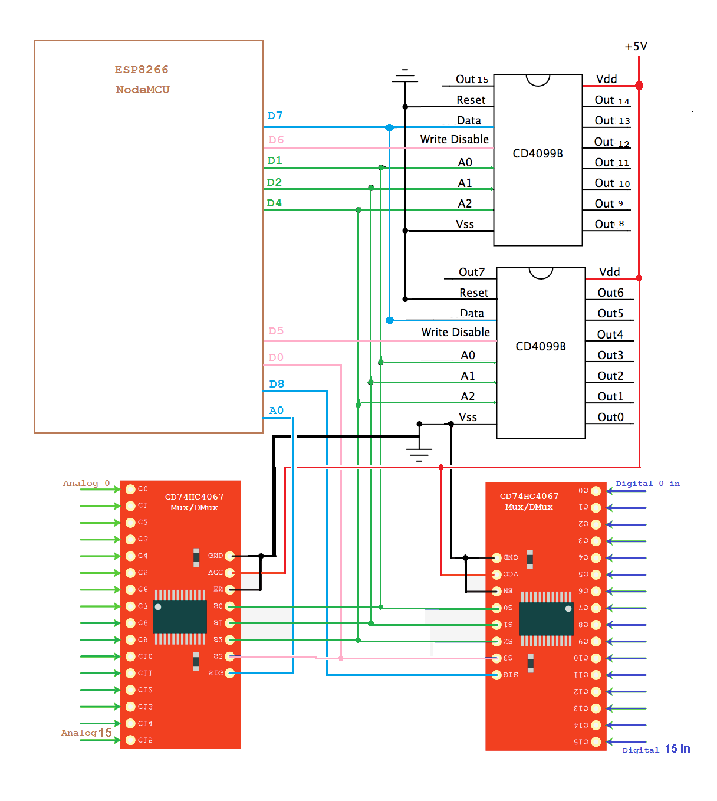
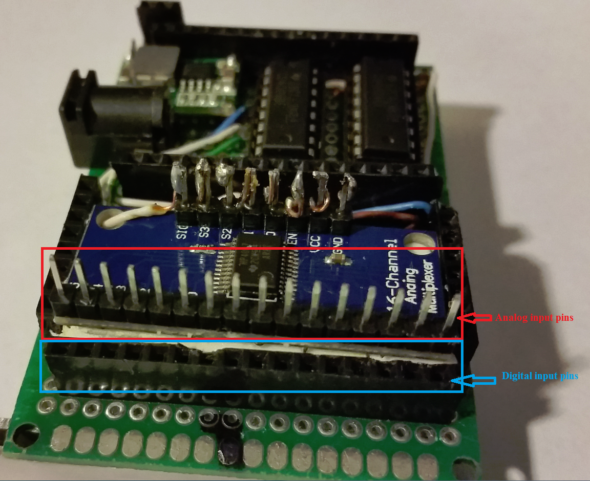
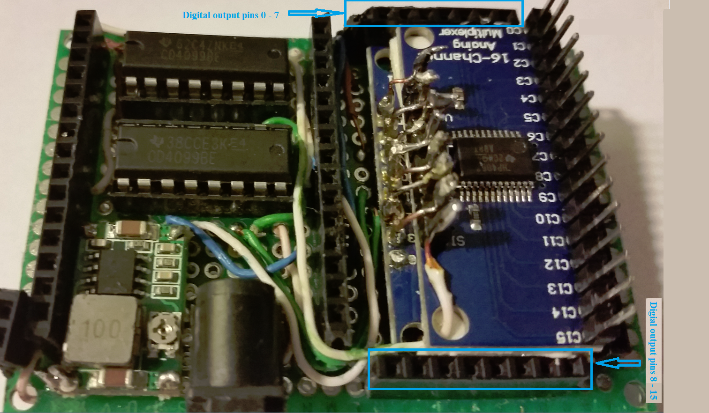
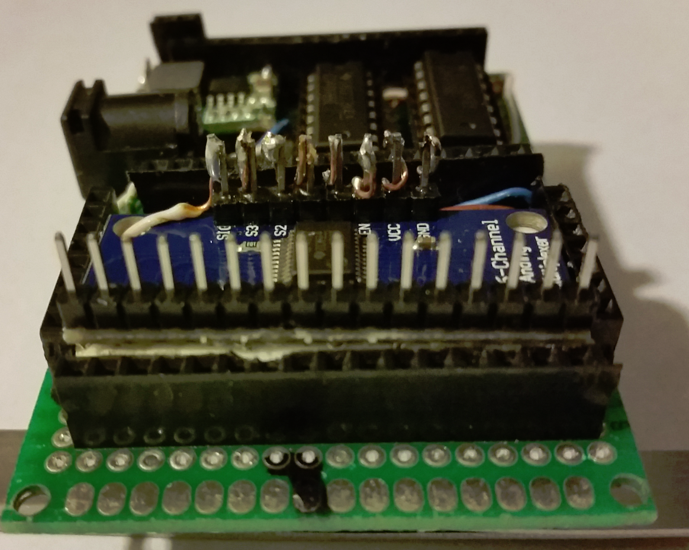
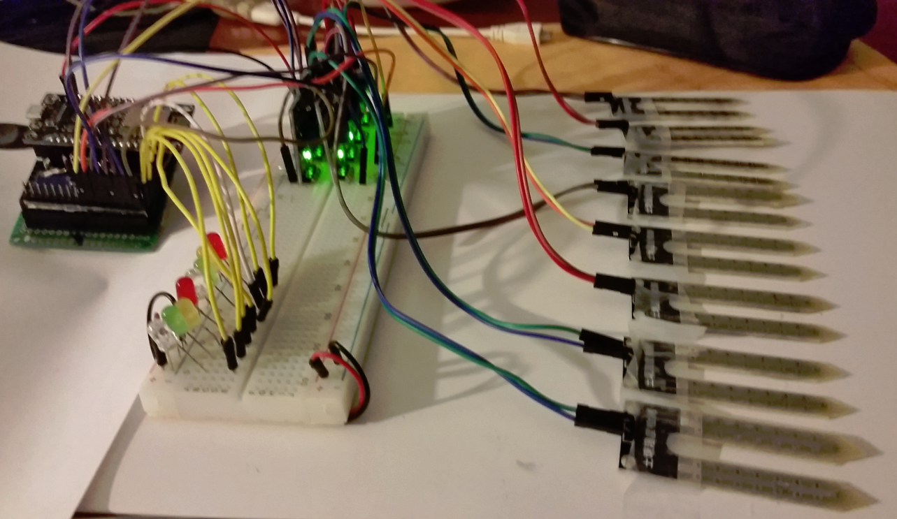
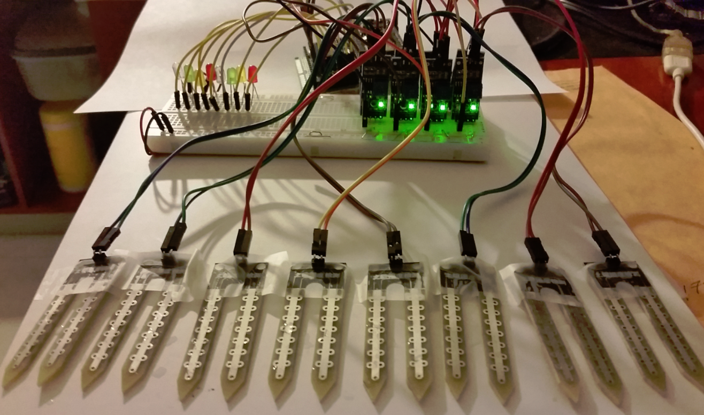
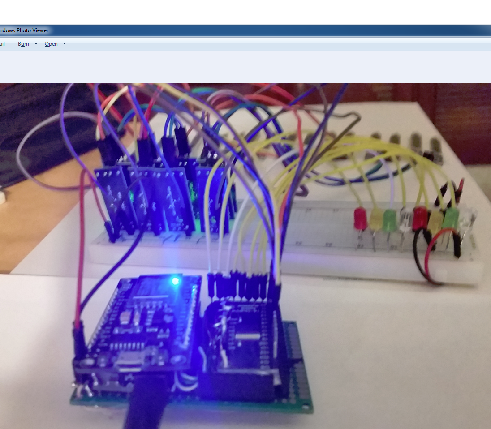

# ESP8266-GPIO-Extender-Plus
Expands the ESP8266 NodeMCU module GPIO to 48 pins (16 digital outputs, 16 digital inputs, and 16 analog inputs) using two CD4099B latch 8-bit chips to provide 16 digital output pins. These output pins have persistant states, meaning that they keep the state that you assign them independent of each other. Two CD74HC4067 multiplexer/de-multiplexer breakout modules are used to provide 16 digital inputs and 16 analog inputs. The two CD4099B and the CD74HC4067 chips share three of the NodeMCU GPIO (D1, D2, and D3) like kind of a common bus.

Latch 1 provides digital ouput pins 0 - 7. Connect the latch chip to the ESP8266 NodeMCU as follows:

D5 ==> write disable -> pin 4 on the CD4099B

D7 ==> data -> pin 3 on the CD4099B

D1 ==> address pins A0 -> pin 5 on the CD4099B

D2 ==> address pins A1 -> pin 6 on the CD4099B

D4 ==> address pins A2 -> pin 7 on the CD4099B

Latch 2 provides digital ouput pins 8 - 15. The second latch chip is optional. Connect the second latch chip to the ESP8266 NodeMCU as follows:

D6 ==> write disable -> pin 4 on the CD4099B

D7 ==> data -> pin 3 on the CD4099B

D1 ==> address pins A0 -> pin 5 on the CD4099B

D2 ==> address pins A1 -> pin 6 on the CD4099B

D4 ==> address pins A2 -> pin 7 on the CD4099B

The class LatchCD4099BDriver is used to manage the digital output pins. Example code:

#include "latch-cd4099B.h"

LatchCD4099BDriver latch(true); // true -> indicates we are using two latches to make it 16 digital output pins. // false -> indicates we are using only one latch to make it 8 digital output pins.

void setup() {
//  latch.enableSerialMonitor =true;     
latch.begin();

}

int oldValue=0; void loop() {
 // put your main code here, to run repeatedly: 
 for (int pin=0;pin<16;pin++)
 {
      if(oldValue==LOW)

      {   
           oldValue=HIGH; 
      } 
      else
      {  
           oldValue=LOW;
      }         
      latch.setPin(pin,oldValue);
      delay(1000); 
  } 
}

==================================================================================================

The first CD74HC4067 multiplexer/de-multiplexer provides 16 digital input pins. Connect the first de-multiplexer chip CD74HC4067 to the ESP8266 NodeMCU as follows:

D8 ==> Signal line on the breakout module

D1 ==> select pin S0

D2 ==> select pin S1

D4 ==> select pin S2

D0 ==> select pin S3

The second CD74HC4067 multiplexer/de-multiplexer provides 16 analog input pins. Connect the second de-multiplexer chip CD74HC4067 to the ESP8266 NodeMCU as follows:

A0 ==> Signal line on the breakout module

D1 ==> select pin S0

D2 ==> select pin S1

D4 ==> select pin S2

D0 ==> select pin S3

#include "multiplexer-CD74HC4067-16-lines.h"

MultiAnalogDigitalRead multiread;

void setup() {
 //   multiread.enableSerialMonitor =true;     
 multiread.begin();

}

void loop() {
 // put your main code here, to run repeatedly:
 int val;
 for (int pin=0;pin<16;pin++) 
 {        
      val = multiread.readAnalog(pin);
     //do something with val      
      delay(1000);
 }

 for (int pin=0;pin<16;pin++)
 {   
      val = multiread.readDigital(pin);
      //do something with val     
      delay(1000);
 }

}

See the provided schematic image for wiring the chips and breakout modules. 

Images of my ESP8266 NodeMCU GPIO Extender Shield.

Watch the GPIO Extender test Video on YouTube.
